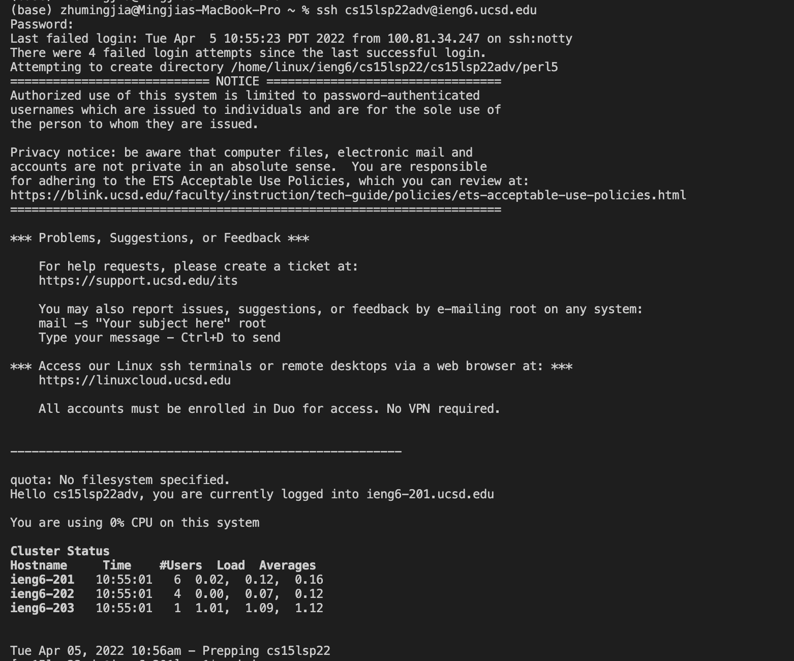

# Heading level 1

## Heading level 2

I really like using Markdown.

I think I'll use it to format all of my documents from now on.

Don't put tabs or spaces in front of your paragraphs.

Keep lines left-aligned like this.

This is the first line.  
And this is the second line.

I just love **bold text**.

Italicized text is the *cat's meow*.

> Dorothy followed her through many of the beautiful rooms in her castle.
>
> The Witch bade her clean the pots and kettles and sweep the floor and keep the fire fed with wood.

1. First item
2. Second item
3. Third item
4. Fourth item

- First item
- Second item
- Third item
- Fourth item

[Lab Report 1](lab-report-1-week-2.html)

[Lab Report 1](https://mingjiazhu.github.io/cse15l-lab-reports/lab-report-1-week-2.html)

