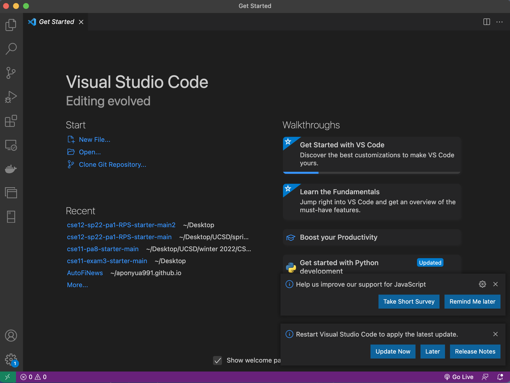
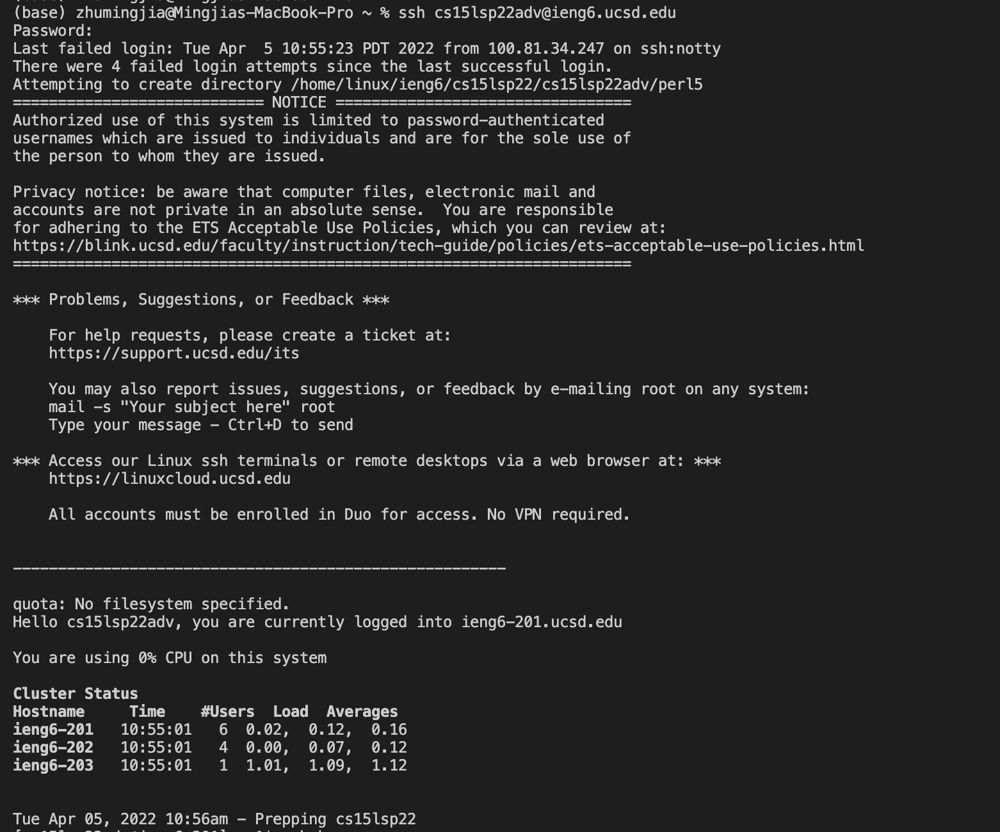
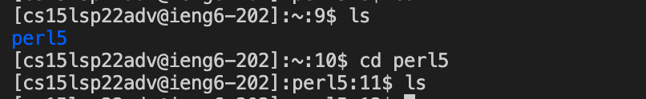
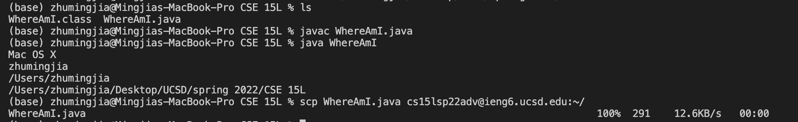
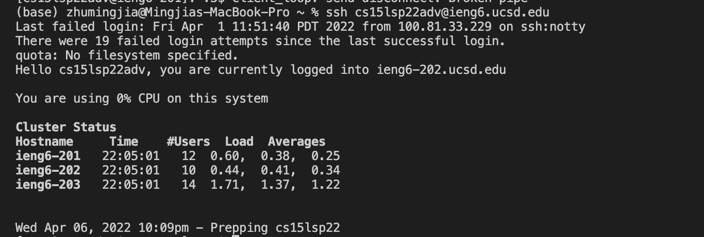
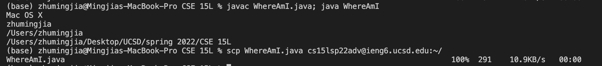

## Week 2 Lab Report

### Installing VSCode

Download VSCode for Mac and install it. The screenshot below shows the interface of VSCode after opening it.
  

### Remotely Connecting

First, install OpenSSH, lookup for CSE15L account and change the password of it. Then type in `ssh _[CSE15L-username]_@ieng6.ucsd.edu` in terminal and enter password. 
  

### Trying Some Commands

Try `ls` and `cd` commands. `ls` command gives us a list of subdirectories in the current directories; `cd` command change the directory.
  

### Moving Files with scp

Create a file on local computer (eg. WhereAmI.java). Run it using javac and java. Then, run `scp _[filename]_ _[CSE15L-username]_@ieng6.ucsd.edu:~/` command and enter the password. Then we could see the file on remote server.
  

### Setting an SSH Key
  
Run `ssh-keygen` on local computer.
Generating public/private rsa key pair.
Enter file in which to save the key (/Users/[user-name]/.ssh/id_rsa): /Users/[user-name]/.ssh/id_rsa
Don't enter passphrase at this step.
Then on server, run `mkdir .ssh`.
On local computer, run `scp /Users/[user-name]/.ssh/id_rsa.pub _[CSE15L-username]_@ieng6.ucsd.edu:~/.ssh/authorized_keys`
Then we will be able to `ssh` or `scp` without a password.
  

### Optimizing Remote Running

Run `javac WhereAmI.java; java WhereAmI`. This command compile and run the WhereAmI.java file.
Then run `scp WhereAmI.java cs15lsp22adv@ieng6.ucsd.edu:~/` This command copy file WhereAmI.java from local computer to remote computer.
  

#### References

[Lab 1 Writeup](https://docs.google.com/document/d/1AO6RDoJnaWxMui-UFjEa_2bbQ4qcANpbIpPuV-awsOg/edit)

[Lab 2 Writeup](https://docs.google.com/document/d/1Nw6gdehL-BzqjeVV1jzi_Ni4cdpx2uquLztLGTdzUdU/edit)
