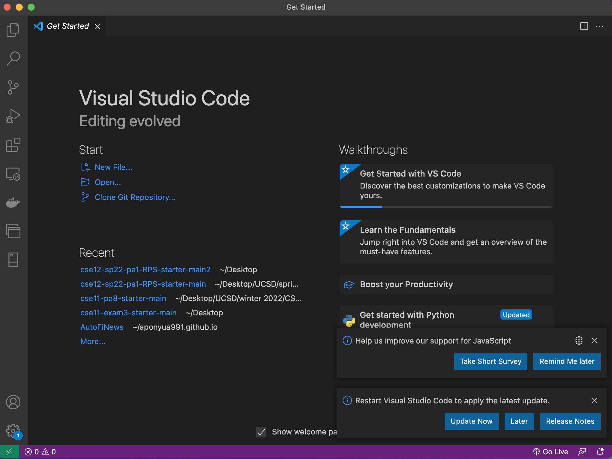
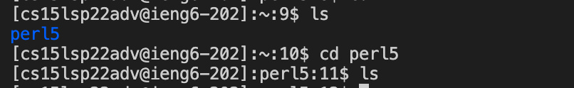

## Week 4 Lab Report

### Three Code Changes to Fix a Bug

Download VSCode for Mac and install it. The screenshot below shows the interface of VSCode after opening it.
  

### Remotely Connecting

First, install OpenSSH, lookup for CSE15L account and change the password of it. Then type in `ssh _[CSE15L-username]_@ieng6.ucsd.edu` in terminal and enter password. 
  

### Trying Some Commands

Try `ls` and `cd` commands. `ls` command gives us a list of subdirectories in the current directories; `cd` command change the directory.
  

