## Week 6 Lab Report

### Streamlining ssh Configuration

1. Show your .ssh/config file, and how you edited it (with VScode, another program, etc)

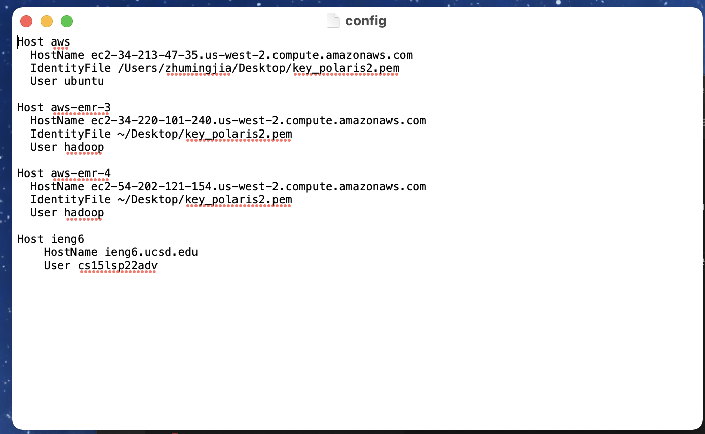
 
I edited this file through txt. 
 

2. Show the ssh command logging you into your account using just the alias you chose.

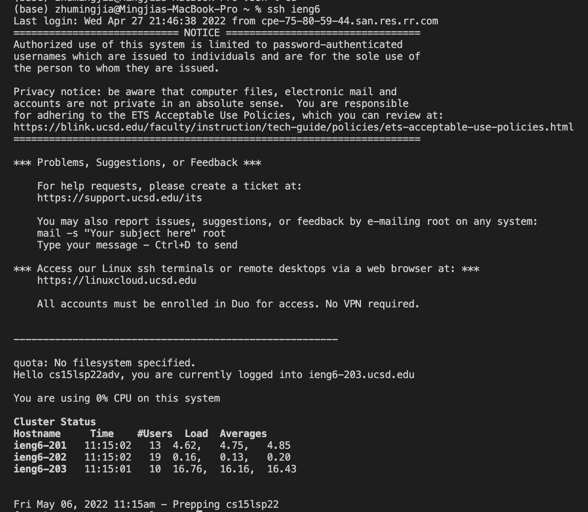
 
I set the host name to be "ieng6", so now I'm able to ssh with `ssh ieng6`.
 

3. Show an scp command copying a file to your account using just the alias you chose.
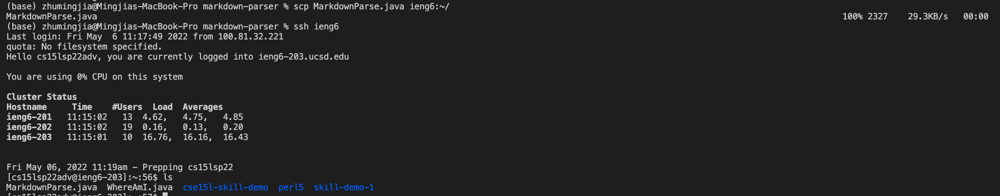
 
I have successfully scp MarkdownParse.java file.
 

### Setup Github Access from ieng6

1. Show where the public key you made is stored on Github and in your user account (screenshot).
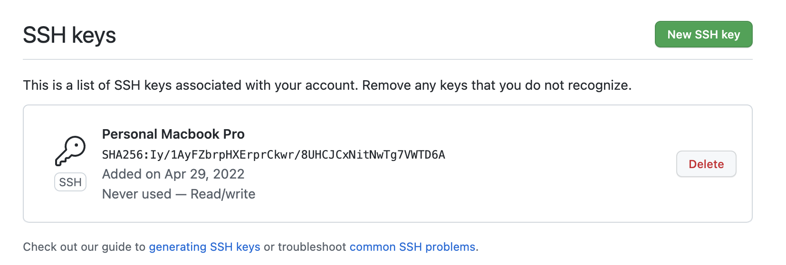
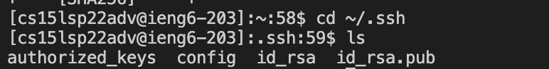
 
This two screenshots show the public key on Github and in my account (id_rsa.pub)

2. Show where the private key you made is stored on your user account (but not its contents) as a screenshot.
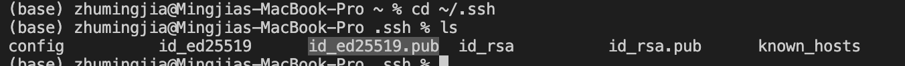
 
I have also set up a private key (id_ed25519.pub).

3. Show running git commands to commit and push a change to Github while logged into your ieng6 account.
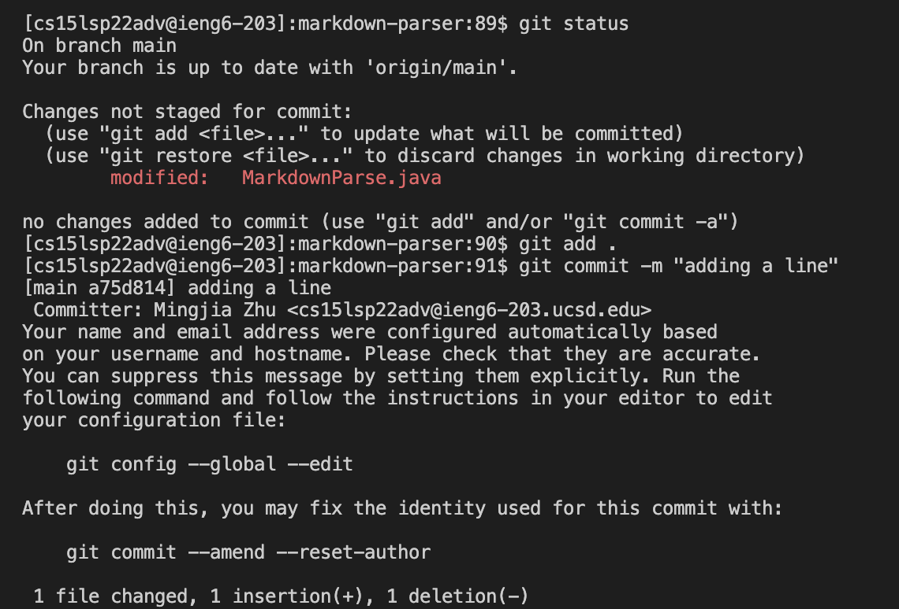
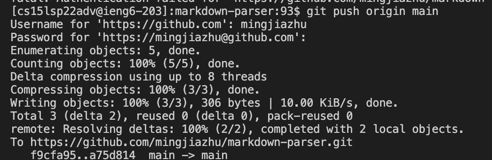
 
I have made a change to the MarkdownParse.java file, and then used `git push origin main` to push the change to GitHub.

4. Show a link for the resulting commit.
[Link to the resulting commit](https://github.com/mingjiazhu/markdown-parser/commit/a75d814102b5d9647a79e656159be8fcda9d7164)

### Copy whole directories with scp -r

1. Show copying your whole markdown-parse directory to your ieng6 account.
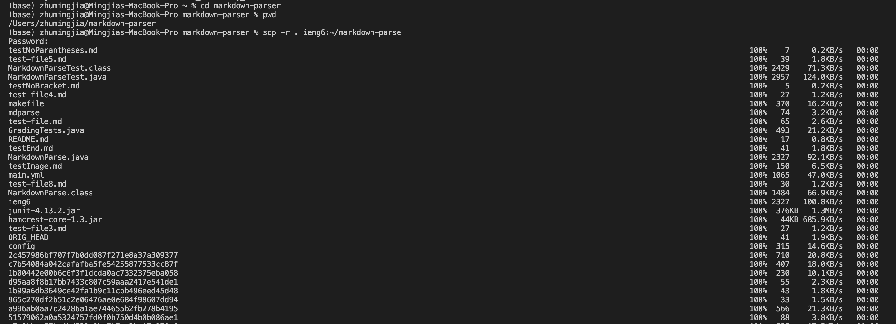
 
I ran `scp -r . ieng6:~/markdown-parse` to scp the whole directory.

2. Show logging into your ieng6 account after doing this and compiling and running the tests for your repository.
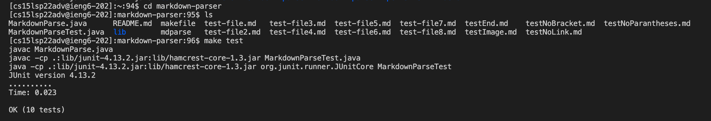
After scp the whole directory, I logged in into my ieng6 account, run `run test` command, which contains the commands to compile and run the tests file. From the screenshot we can see that it succeed.

3. Show (like in the last step of the first lab) combining scp, ;, and ssh to copy the whole directory and run the tests in one line.

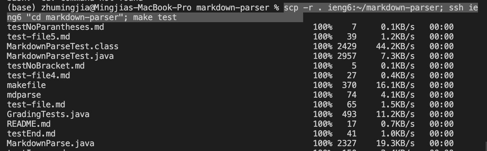
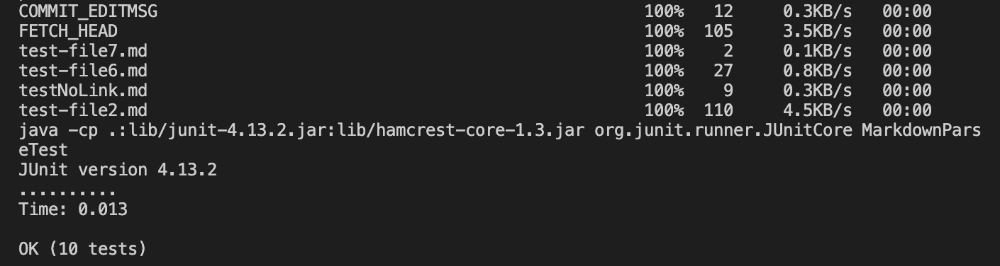
 
I ran the command `scp -r . ieng6:~/markdown-parser; ssh ieng6 "cd markdown-parser"; make test`, which successfully did all of the task in oneline.