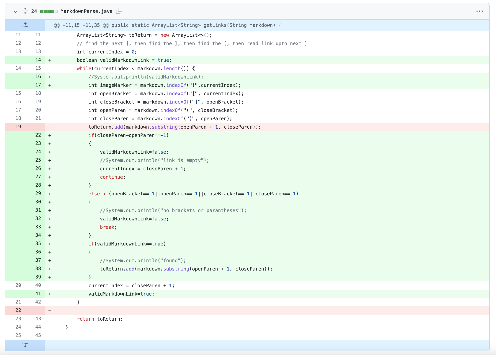
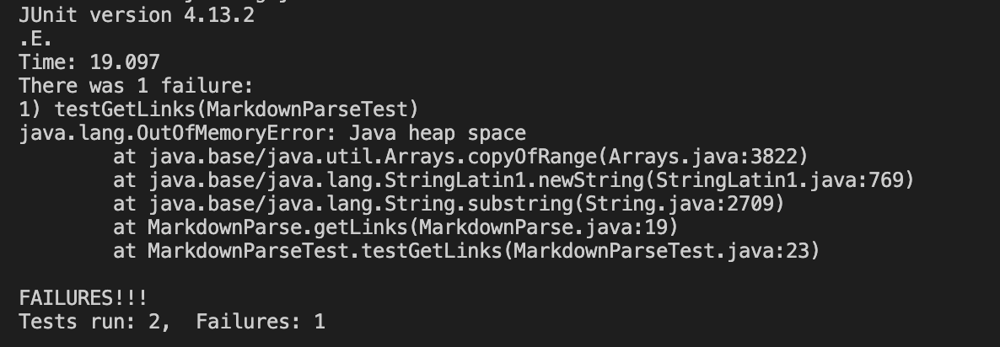
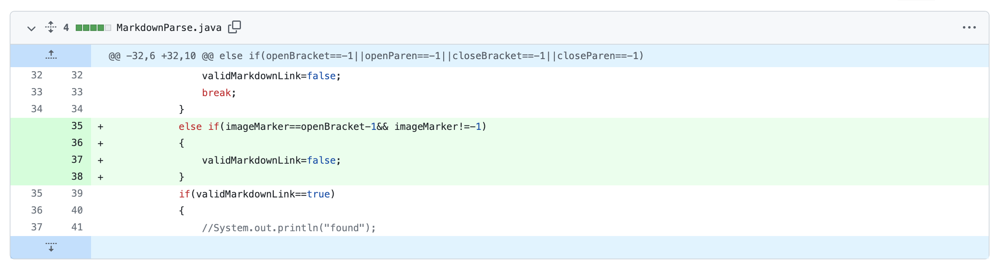
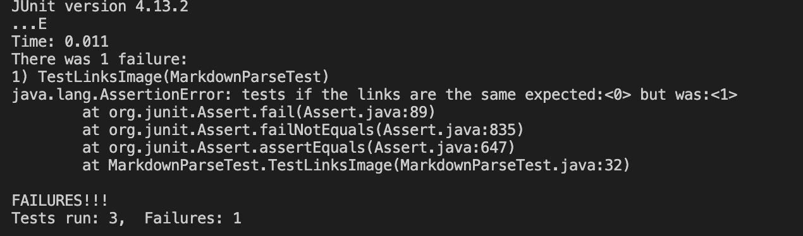
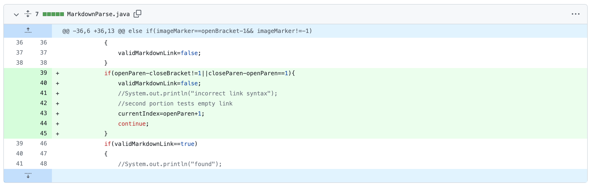
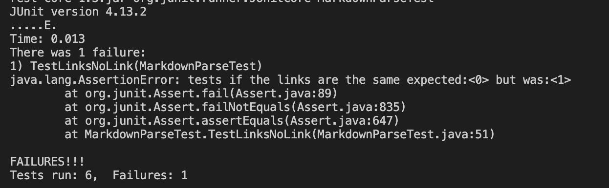

## Week 4 Lab Report

### Code Change 1

 
[Link to the test file for a failure-inducing input that prompted us to make code change 1](https://github.com/mingjiazhu/markdown-parser/blob/858454b676860c0b815ad0236e108a17d2c36d18/MarkdownParseTest.java)

Symptom:

 
We didn't update the currentIndex variable in the while loop (this is an error in our code), so the function keep running and never ends. The error causes the  OutOfMemory symptom. In the tester we ran the getLinks function, which triggered the symptom.

### Code Change 2

 
[Link to the test file for a failure-inducing input that prompted us to make code change 2](https://github.com/mingjiazhu/markdown-parser/blob/0ea309748b9e688eb5a6393f5aaa39deb614e652/MarkdownParseTest.java)

Symptom:

 
In the former code we didn't consider the case of image, so it doesn't work for a file with an image reference. This bug caused the failure in TestLinksImage function, the assertEquals failed, the program produced wrong answer. The tester that tested the getLinks function with testImage.md is failure-inducing input, which triggered the symptom.

### Code Change 3

 
[Link to the test file for a failure-inducing input that prompted us to make code change 3](https://github.com/mingjiazhu/markdown-parser/blob/2481cc0890a89726ed85981f1b6fa94a84ed0307/MarkdownParseTest.java)

Symptom:

 
We didn't consider the case when the file contains no links, so this bug caused the symptom: the program produced wrong answer. The failure-inducing input was in the TestLinksNoLink function, which called the getLinks function on a file with no link. This triggered the symptom.
