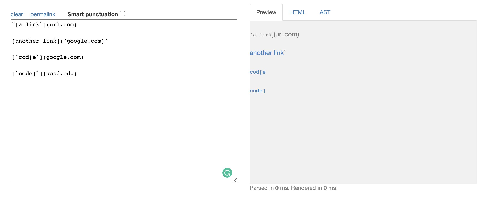
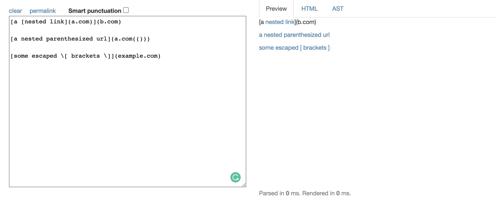
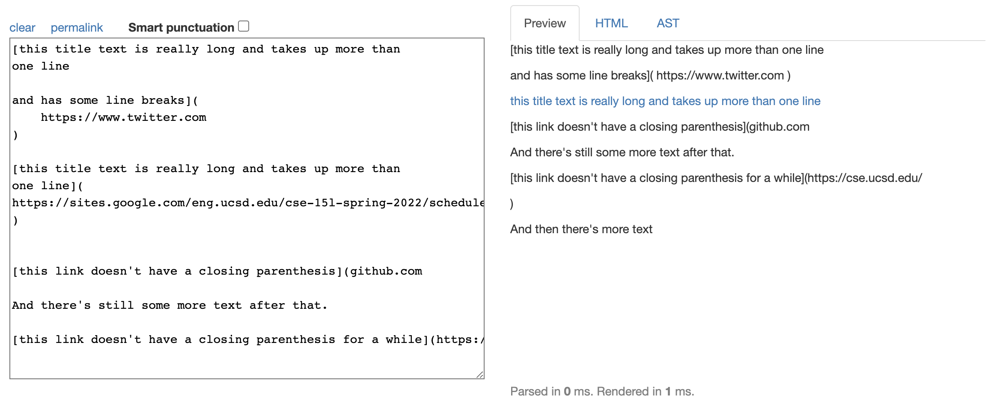
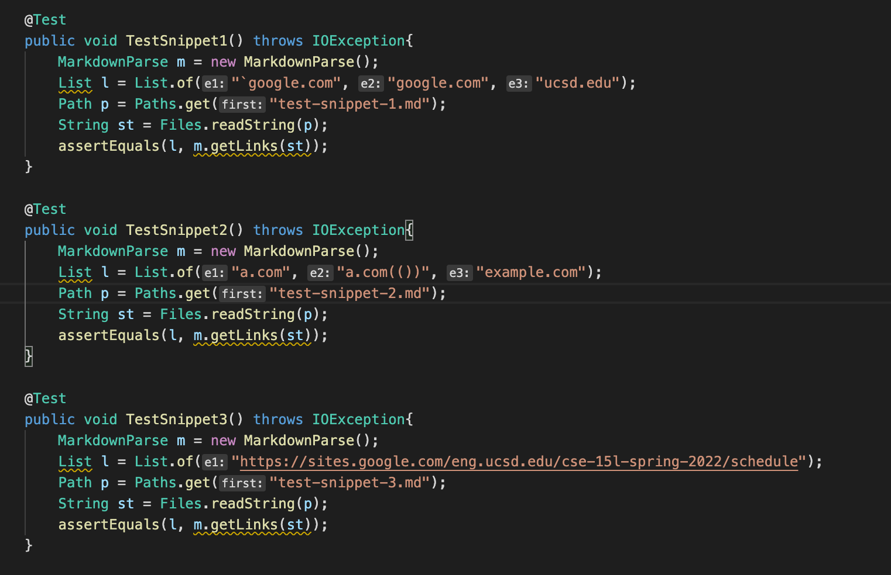
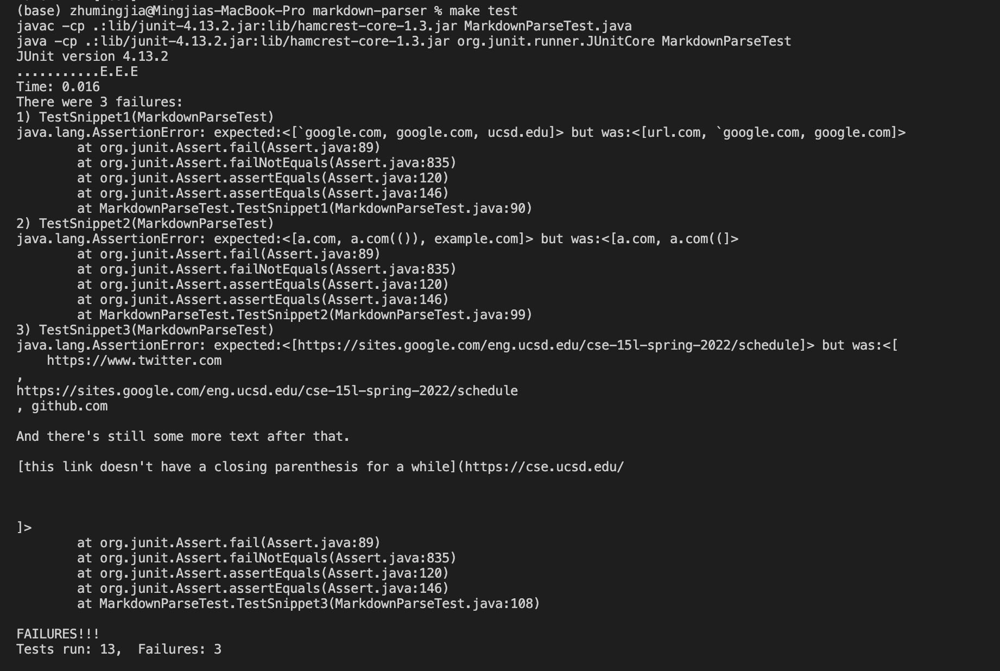
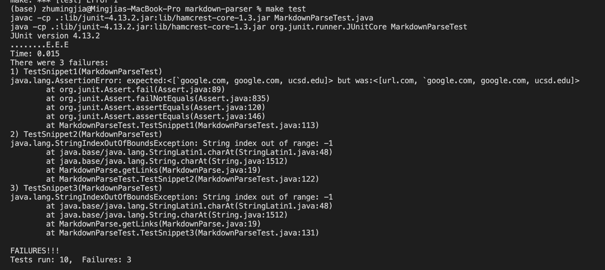

## Week 8 Lab Report

### Links of the two repositories

[Link to my repo](https://github.com/mingjiazhu/markdown-parser)

[Link to the review repo](https://github.com/Hiro-229/markdown-parser)

### Expected output

Snippet 1:

 
Snippet 2:

 
Snippet 3:

### Tests

These three tests are the tests for Snippet 1-3:

### Output

Output of my implementation:

Output of the review implementation:

### Answers for the questions
1. For snippet 1, I think there is a small code change that will make my program work. I could add a condition that check whether the current character is a backtick, if it is, then find the next backtick. Then we remove the content between the two backticks so they are not considered when extracting the links.
 
2. For snippet 2, I think there is not a small code change that will make my program work. Since there might be parentheses in the links, we cannot tell that whether the parentheses are a part of the link or it is functional.
 
3. For snippet 3, I think there is not a small code change that will make my program work. We could add a condition. There are different conditions that we need to consider, including line breaks in parentheses, linke breaks in brackets, etc. Thus it would be hard for us to figure out a small code change.

