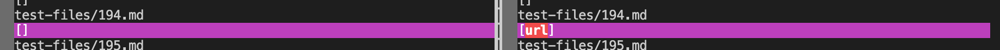
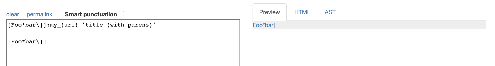
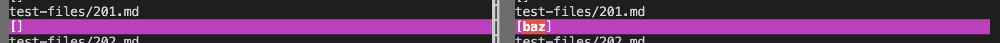
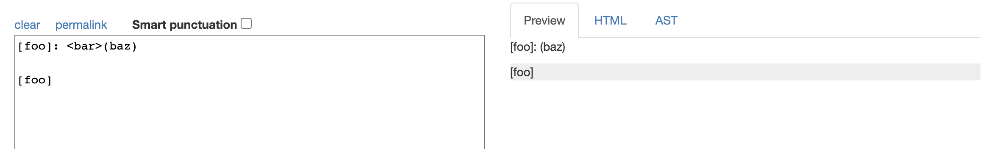
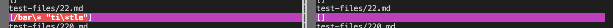
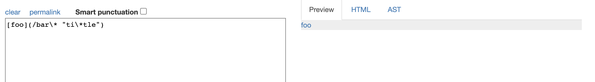
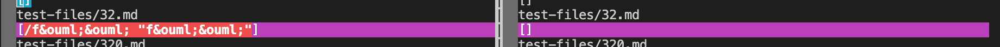
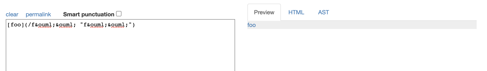
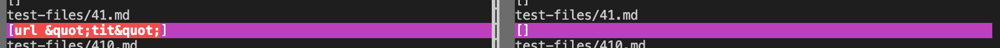
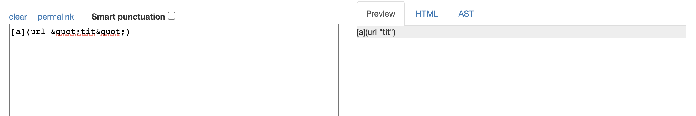

## Week 10 Lab Report

### How you found the tests with different results?

I used vimdiff.

### Provide a link to the test-file with different-results

[194.md](https://github.com/nidhidhamnani/markdown-parser/blob/main/test-files/194.md)

[201.md](https://github.com/nidhidhamnani/markdown-parser/blob/main/test-files/201.md)

[22.md](https://github.com/nidhidhamnani/markdown-parser/blob/main/test-files/22.md)

[32.md](https://github.com/nidhidhamnani/markdown-parser/blob/main/test-files/32.md)

[41.md](https://github.com/nidhidhamnani/markdown-parser/blob/main/test-files/41.md)

### Answers for the questions

test 194:
 
actual outputs:
 

expected output:
 

 
Both implementations produce incorrect results. The expected result should be `[my_(url)]`. For the given implementation, since it is extracting the contents between open and close parentheses, it only gets "url" in the parentheses. 
 

test 201:
 
actual outputs:
 

expected output:
 

 
My implementation (left) is correct. For the given implementation, since it is extracting the contents between open and close parentheses no matter it is a url, thus it is getting "baz", which is the content in the parentheses.
 

test 22:
 
actual outputs:
 

expected output:
 

 
Both implementations produce incorrect results. The correct result should be `bar*`. For my implementation, since I'm not considering the slash and backslash in the url, it is producing the whole contents in the parentheses.
 

test 32:
 
actual outputs:
 

expected output:
 

 
Both implementations produce incorrect results. The correct result should be `föö`. For my implementation, since I'm not considering the characters like "&" and ";", it is directly producing the whole contents in the parentheses.
 

test 41:
 
actual outputs:
 

expected output:
 

 
The given implementation (right) produces correct results. For my implementation, since I'm not considering the characters like "&" and ";", it is producing the contents in the parentheses no matter whether they belong to a url.

