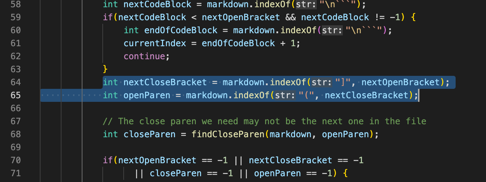
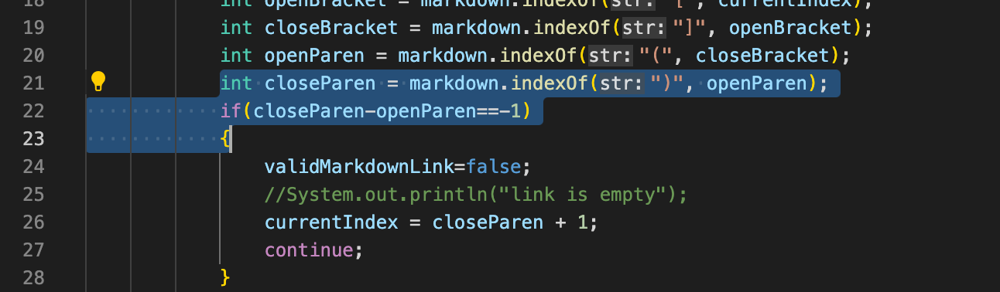

## Week 10 Lab Report

### How you found the tests with different results?

I used vimdiff.

### Provide a link to the test-file with different-results

[194.md](https://github.com/nidhidhamnani/markdown-parser/blob/main/test-files/194.md)

[201.md](https://github.com/nidhidhamnani/markdown-parser/blob/main/test-files/201.md)

[22.md](https://github.com/nidhidhamnani/markdown-parser/blob/main/test-files/22.md)

[32.md](https://github.com/nidhidhamnani/markdown-parser/blob/main/test-files/32.md)

[41.md](https://github.com/nidhidhamnani/markdown-parser/blob/main/test-files/41.md)

### Answers for the questions

test 194:
 
actual outputs:
 

 
expected output:
 

 
Both implementations produce incorrect results. The expected result should be `[my_(url)]`. For the given implementation, since it is extracting the contents between open and close parentheses, it only gets "url" in the parentheses. 
 

 
To fix the bug, we need to add several lines of code between line 64 and 65. We need to consider the situation that there's colon in the markdown. When there's a colon, we get the part after it until a space appears.
 

test 201:
 
actual outputs:
 

 
expected output:
 

 
My implementation (left) is correct. For the given implementation, since it is extracting the contents between open and close parentheses no matter it is a url, thus it is getting "baz", which is the content in the parentheses.
 

 
To fix the bug, we need to add several lines of code between line 64 and 65. We need to consider the situation that there are "<>" between bracket and parenthese. When there are "<>" between bracket and parenthese, we don't consider it as a url.
 

test 22:
 
actual outputs:
 

 
expected output:
 

 
Both implementations produce incorrect results. The correct result should be `bar*`. For my implementation, since I'm not considering the slash and backslash in the url, it is producing the whole contents in the parentheses.
 

 
To fix the bug, we need to add an if statement at this part (line 22-23) to check whether there's space between an open and a close parenthese. If there's space, we only extract the part before the space.
 

test 32:
 
actual outputs:
 

 
expected output:
 

 
Both implementations produce incorrect results. The correct result should be `föö`. For my implementation, since I'm not considering the characters like "&" and ";", it is directly producing the whole contents in the parentheses.
 

 
To fix the bug, we need to add an if statement at this part (line 22-23) to check special characters in the markdown. The "ö" in this url was not considered in my implementation.
 

test 41:
 
actual outputs:
 

 
expected output:
 

 
The given implementation (right) produces correct results. For my implementation, since I'm not considering the characters like "&" and ";", it is producing the contents in the parentheses no matter whether they belong to a url.

 
To fix the bug, we need to add an if statement at this part (line 22-23) to check the quotation marks in the markdown file. We need to exclude the content in the quotation marks in the url.
 

